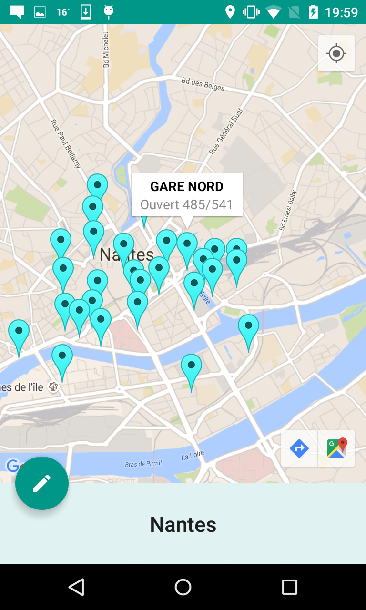
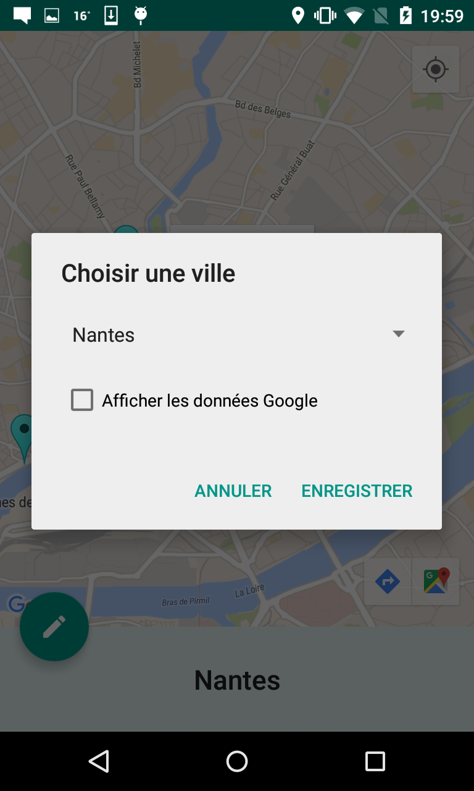
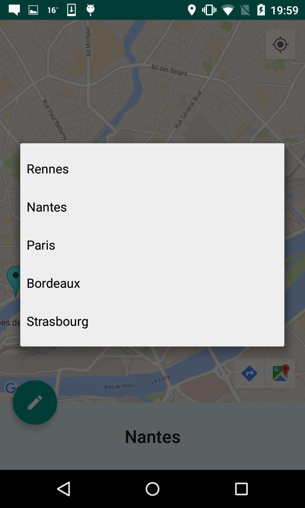
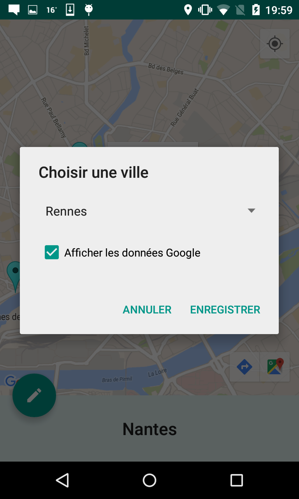
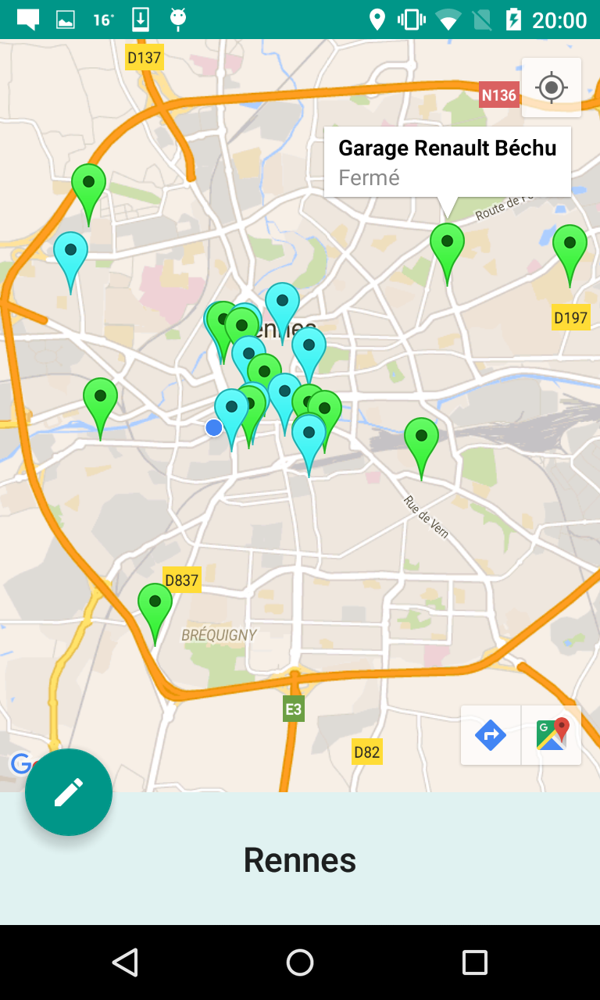

# ParkingFacile

This an application that uses the open data provided by various towns in france and locates different parking spots in those towns. It also features data provided by google places Api

Requirements

    Android 4.3 (Jelly Bean MR2) +

Credits

    All HTTP request are made using loopj
